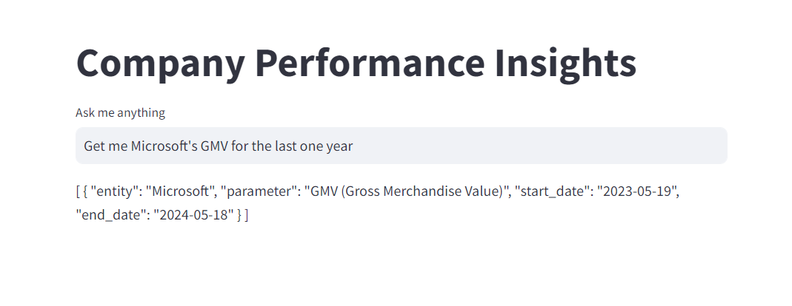
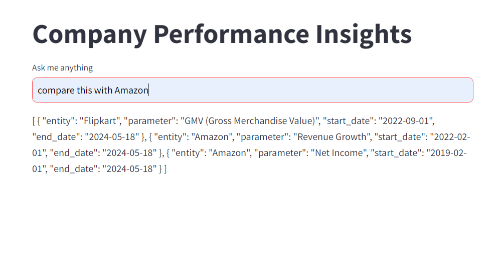

Company Performance Insights with Streamlit
This Streamlit application extracts company performance information from user queries and presents it in a structured JSON format.

-----------------------------------------------------------------------------------------------------------

Features:

Extracts company names, performance metrics, start dates, and end dates.
Handles relative dates (e.g., "today", "one year ago").
Displays results as JSON.

--------------------------------------------------------------------------------------------------------------

Requirements:

langchain_core
langchain_community
streamlit
dotenv
Ollama (for LLM access)

-------------------------------------------------------------------------------------------------------------

Instructions:

Install required libraries.
Set up a .env file with your LANGCHAIN_API_KEY.
Run the script: python script.py

--------------------------------------------------------------------------------------------------------------

Using the App:

Enter your question in the text input box.
Click "Enter" or submit the query.
The extracted information will be displayed in JSON format.

---------------------------------------------------------------------------------------------------------------

Example Query:

Question: What is the recent performance of Apple and Google?

Disclaimer:

This is a basic example and may require further development for real-world use cases.

------------------------------------------------------------------------------------------------------------------

RESULTS:

------------------------------------------------------------------------------------------------------------------
Deployment:

Deployed this application on Streamlit cloud platform. which provides single click deployment.

------------------------------------------------------------------------------------------------------------------

Model performance:

As i am using locally installed llama2 opensource model it provides sometimes inaccurate results. and due to my system specifications it takes 1-2 minutes to process the query and provides output

--------------------------------------------------------------------------------------------------------------------

Additional Notes:

The code utilizes ChatPromptTemplate to define the interaction between the user and the LLM.
The StrOutputParser parses the LLM's output for relevant information.
Ollama is used to access the LLM (replace "llama2" with your desired model if needed).
Streamlit is used to create the interactive web app.
The script handles relative dates and converts them to absolute formats.
The context is stored in the session state to keep track of previous queries and extracted information.
I hope this README provides a clear understanding of the code and its functionality. 

-----------------------------------------------------------------------------------------------------------------

Streamlit application URL 

http://192.168.84.33:8501/ 